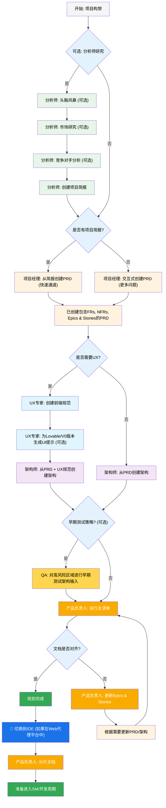

# BMad 方法 — 用户指南

本指南将帮助您理解并有效使用 BMad 方法，以进行敏捷的 AI 驱动规划和开发。

## BMad 规划与执行工作流

首先，这里是完整的标准“绿地”（Greenfield）规划 + 执行工作流。“棕地”（Brownfield）项目的工作流非常相似，但建议您先理解绿地工作流，即使只是在一个简单的项目上实践，之后再处理棕地项目。BMad 方法需要安装到您新项目文件夹的根目录。对于规划阶段，您可以选择使用强大的 Web 代理（web agents）来执行，这可能会以更低的成本获得更高质量的结果，相比于在某些代理工具（Agentic tools）中提供您自己的 API 密钥或额度。在规划阶段，强大的思维模型和更广的上下文，再加上与代理的合作，将会产生最佳效果。

如果您打算在“棕地”项目（一个现有项目）中使用 BMad 方法，请查阅 **[在棕地项目中工作](./working-in-the-brownfield.md)**。

如果下面的图表无法渲染，请在 VSCode（或其某个复刻克隆版）中安装 Markdown All in One 以及 Markdown Preview Mermaid Support 插件。安装这些插件后，当您打开文件时，右键单击标签页应该会有一个“打开预览”的选项，或者查阅您 IDE 的文档。

### 规划工作流（Web UI 或强大的 IDE 代理）

在开发开始之前，BMad 遵循一个结构化的规划工作流，为了成本效益，最好在 Web UI 中完成：



#### 从 Web UI 到 IDE 的过渡

**关键过渡点**：一旦产品负责人（PO）确认文档对齐，您必须从 Web UI 切换到 IDE 以开始开发工作流：

1.  **复制文档到项目**：确保 `docs/prd.md` 和 `docs/architecture.md` 在您项目的 `docs` 文件夹中（或在安装时可以指定的自定义位置）。
2.  **切换到 IDE**：在您偏好的代理式 IDE (Agentic IDE) 中打开您的项目。
3.  **文档分片**：使用 PO 代理对 PRD 进行分片，然后对架构文档进行分片。
4.  **开始开发**：开始接下来的核心开发周期。

#### 规划产物（标准路径）

```text
PRD (产品需求文档)     → docs/prd.md
Architecture (架构) → docs/architecture.md
Sharded Epics (分片史诗) → docs/epics/
Sharded Stories (分片故事)→ docs/stories/
QA Assessments (质量评估)→ docs/qa/assessments/
QA Gates (质量门禁)     → docs/qa/gates/
```

### 核心开发周期 (IDE)

一旦规划完成且文档已分片，BMad 将遵循一个结构化的开发工作流：

```mermaid
graph TD
    A["开发阶段开始"] --> B["SM: 回顾之前的用户故事开发/QA笔记"]
    B --> B2["SM: 从分片的Epic和架构草拟下一个用户故事"]
    B2 --> S{"是否为高风险故事? (可选)"}
    S -->|是| T["QA: 对草稿故事执行 *risk + *design"]
    S -->|否| B3
    T --> U["创建测试策略和风险档案"]
    U --> B3{"PO: 验证故事草稿 (可选)"}
    B3 -->|请求验证| B4["PO: 根据产物验证故事"]
    B3 -->|跳过验证| C{"用户批准"}
    B4 --> C
    C -->|已批准| D["开发: 顺序执行任务"]
    C -->|需修改| B2
    D --> E["开发: 实现任务 + 测试"]
    E --> V{"开发中期QA检查? (可选)"}
    V -->|是| W["QA: 执行 *trace 或 *nfr 进行早期验证"]
    V -->|否| F
    W --> X["开发: 解决覆盖率/NFR差距"]
    X --> F["开发: 运行所有验证"]
    F --> G["开发: 标记为待审查 + 添加笔记"]
    G --> H{"用户验证"}
    H -->|请求QA审查| I["QA: 测试架构师审查 + 质量门禁"]
    H -->|无QA批准| M["重要: 验证所有回归测试和Linting都通过"]
    I --> J["QA: 测试架构分析 + 主动重构"]
    J --> L{"QA决策"}
    L -->|需要开发工作| D
    L -->|已批准| M
    H -->|需要修复| D
    M --> N["重要: 在继续之前提交您的更改!"]
    N --> Y{"是否需要更新门禁状态?"}
    Y -->|是| Z["QA: 执行 *gate 更新状态"]
    Y -->|否| K
    Z --> K["将故事标记为完成"]
    K --> B

    style A fill:#f5f5f5,color:#000
    style B fill:#e8f5e9,color:#000
    style B2 fill:#e8f5e9,color:#000
    style S fill:#e3f2fd,color:#000
    style T fill:#ffd54f,color:#000
    style U fill:#ffd54f,color:#000
    style B3 fill:#e3f2fd,color:#000
    style B4 fill:#fce4ec,color:#000
    style C fill:#e3f2fd,color:#000
    style D fill:#e3f2fd,color:#000
    style E fill:#e3f2fd,color:#000
    style V fill:#e3f2fd,color:#000
    style W fill:#ffd54f,color:#000
    style X fill:#e3f2fd,color:#000
    style F fill:#e3f2fd,color:#000
    style G fill:#e3f2fd,color:#000
    style H fill:#e3f2fd,color:#000
    style I fill:#f9ab00,color:#fff
    style J fill:#ffd54f,color:#000
    style K fill:#34a853,color:#fff
    style L fill:#e3f2fd,color:#000
    style M fill:#ff5722,color:#fff
    style N fill:#d32f2f,color:#fff
    style Y fill:#e3f2fd,color:#000
    style Z fill:#ffd54f,color:#000
```



## 先决条件

在安装 BMad 方法之前，请确保您已具备：

- **Node.js** ≥ 18, **npm** ≥ 9
- **Git** 已安装并配置好
- **(可选)** VS Code 及 "Markdown All in One" + "Markdown Preview Mermaid Support" 扩展

## 安装

### 可选步骤

如果您想在 Web 上使用 Claude (Sonnet 4 或 Opus)、Gemini Gem (2.5 Pro) 或自定义 GPTs 进行规划：

1.  导航到 `dist/teams/` 目录
2.  复制 `team-fullstack.txt` 的内容
3.  创建一个新的 Gemini Gem 或 CustomGPT
4.  上传文件并附上指令：“您关键的操作指令已附上，请严格按照指示扮演角色，不要脱离角色。”
5.  输入 `/help` 查看可用命令

### IDE 项目设置

```bash
# 交互式安装 (推荐)
npx bmad-method install
```

## 特殊代理

有两个 BMad 代理 — 未来它们将被合并为一个 BMad-Master。

### BMad-Master

该代理可以执行所有其他代理能做的任何任务或命令，除了实际的用户故事实现。此外，当在 Web 上时，该代理可以通过访问知识库来帮助解释 BMad 方法，向您解释关于流程的任何事情。

如果您不想除了开发代理之外，还费心在不同代理之间切换，那么这个代理就适合您。只需记住，随着上下文的增长，代理的性能会下降，因此重要的是指示代理压缩对话，并以压缩后的对话作为初始消息开始新的对话。请经常这样做，最好在每个用户故事实现后都这样做一次。

### BMad-Orchestrator

该代理不应在 IDE 中使用，它是一个重量级的、特殊用途的代理，利用大量上下文，并且可以变形为任何其他代理。它的存在完全是为了在 Web 包中协调团队。如果您使用 Web 包，您将会被 BMad Orchestrator 迎接。

### 代理如何工作

#### 依赖系统

每个代理都有一个 YAML 部分来定义其依赖项：

```yaml
dependencies:
  templates:
    - prd-template.md
    - user-story-template.md
  tasks:
    - create-doc.md
    - shard-doc.md
  data:
    - bmad-kb.md
```

**关键点：**

-   代理只加载它们需要的资源（精简上下文）
-   依赖项在打包过程中自动解析
-   资源在代理之间共享以保持一致性

#### 代理交互

**在 IDE 中：**

```bash
# 某些 IDE，例如 Cursor 或 Windsurf，使用手动规则，因此交互通过'@'符号完成
@pm 创建一个任务管理应用的PRD
@architect 设计系统架构
@dev 实现用户认证功能

# 某些 IDE，例如 Claude Code，则使用斜杠命令
/pm 创建用户故事
/dev 修复登录bug
```

#### 交互模式

-   **增量模式 (Incremental Mode)**：通过用户输入逐步进行
-   **YOLO 模式 (YOLO Mode)**：以最少的交互快速生成

## IDE 集成

### IDE 最佳实践

-   **上下文管理**：仅将相关文件保留在上下文中，保持文件尽可能精简和专注
-   **代理选择**：为任务使用合适的代理
-   **迭代开发**：以小而专注的任务进行工作
-   **文件组织**：保持清晰的项目结构
-   **定期提交**：频繁保存您的工作

## 测试架构师（QA 代理）

### 概述

BMad 中的 QA 代理不仅仅是一个“高级开发评审员”——它是一位在测试策略、质量门禁和基于风险的测试方面拥有深厚专业知识的**测试架构师**。该代理名为 Quinn，它在质量问题上提供咨询权威，同时在安全的情况下主动改进代码。

#### 快速入门（基本命令）

```bash
@qa *risk {story}       # 开发前评估风险
@qa *design {story}     # 创建测试策略
@qa *trace {story}      # 开发期间验证测试覆盖率
@qa *nfr {story}        # 检查质量属性
@qa *review {story}     # 全面评估 → 编写门禁文件
```

#### 命令别名（测试架构师）

为了方便，文档中使用缩写形式。两种形式都有效：

```text
*risk    → *risk-profile
*design  → *test-design
*nfr     → *nfr-assess
*trace   → *trace-requirements (或简写为 *trace)
*review  → *review
*gate    → *gate
```

### 核心能力

#### 1. 风险画像 (`*risk`)

**时机：** 故事草稿完成后，开发开始前（最早的干预点）

识别和评估实施风险：

-   **类别**：技术、安全、性能、数据、业务、运营
-   **评分**：概率 × 影响分析（1-9分制）
-   **缓解措施**：针对每个已识别风险的具体策略
-   **对门禁的影响**：风险 ≥9 触发 FAIL，≥6 触发 CONCERNS（权威规则请参见 `tasks/risk-profile.md`）

#### 2. 测试设计 (`*design`)

**时机：** 故事草稿完成后，开发开始前（指导编写哪些测试）

创建全面的测试策略，包括：

-   针对每个验收标准的测试场景
-   合适的测试级别建议（单元 vs 集成 vs E2E）
-   基于风险的优先级划分（P0/P1/P2）
-   测试数据要求和模拟策略
-   用于 CI/CD 集成的执行策略

**输出示例：**

```yaml
test_summary:
  total: 24
  by_level:
    unit: 15
    integration: 7
    e2e: 2
  by_priority:
    P0: 8 # 必须有 - 关联到关键风险
    P1: 10 # 应该有 - 中等风险
    P2: 6 # 可以有 - 低风险
```

#### 3. 需求追溯 (`*trace`)

**时机：** 开发期间（实现过程中的检查点）

将需求映射到测试覆盖率：

-   记录哪些测试验证了每个验收标准
-   使用 Given-When-Then 格式以保证清晰（仅用于文档，非 BDD 代码）
-   识别覆盖率差距并评定严重性
-   创建可追溯性矩阵以供审计

#### 4. 非功能性需求评估 (`*nfr`)

**时机：** 开发期间或早期审查时（验证质量属性）

验证非功能性需求：

-   **四大核心**：安全性、性能、可靠性、可维护性
-   **基于证据**：寻找实际的实现证明
-   **与门禁集成**：NFR 失败直接影响质量门禁

#### 5. 全面测试架构审查 (`*review`)

**时机：** 开发完成，故事被标记为“待审查”后

当您运行 `@qa *review {story}` 时，Quinn 会执行：

-   **需求可追溯性**：将每个验收标准映射到其验证测试
-   **测试级别分析**：确保在单元、集成和 E2E 级别有适当的测试
-   **覆盖率评估**：识别覆盖率差距和冗余测试
-   **主动重构**：在安全的情况下直接提高代码质量
-   **质量门禁决策**：根据发现结果发布 PASS/CONCERNS/FAIL 状态

#### 6. 质量门禁 (`*gate`)

**时机：** 审查修复后或需要更新门禁状态时

管理质量门禁决策：

-   **确定性规则**：明确的 PASS/CONCERNS/FAIL 标准
-   **并行权限**：QA 拥有 `docs/qa/gates/` 中的门禁文件
-   **咨询性质**：提供建议，而非阻塞
-   **豁免支持**：在需要时记录已接受的风险

**注意：** 门禁是咨询性的；团队自己选择他们的质量标准。WAIVED（豁免）需要原因、批准人和到期日期。模式请参见 `templates/qa-gate-tmpl.yaml`，评分规则请参见 `tasks/review-story.md` (门禁规则) 和 `tasks/risk-profile.md`。

### 与测试架构师协作

#### 与 BMad 工作流集成

测试架构师在整个开发生命周期中提供价值。以下是何时以及如何利用每种能力：

| **阶段** | **命令** | **使用时机** | **价值** | **输出** |
| :--- | :--- | :--- | :--- | :--- |
| **故事草拟** | `*risk` | SM 草拟故事后 | 尽早识别陷阱 | `docs/qa/assessments/{epic}.{story}-risk-{YYYYMMDD}.md` |
| | `*design` | 风险评估后 | 指导开发测试策略 | `docs/qa/assessments/{epic}.{story}-test-design-{YYYYMMDD}.md` |
| **开发** | `*trace` | 实现中期 | 验证测试覆盖率 | `docs/qa/assessments/{epic}.{story}-trace-{YYYYMMDD}.md` |
| | `*nfr` | 构建功能时 | 尽早发现质量问题 | `docs/qa/assessments/{epic}.{story}-nfr-{YYYYMMDD}.md` |
| **审查** | `*review` | 故事标记为完成时 | 全面质量评估 | 故事中的 QA 结果 + 门禁文件 |
| **审查后** | `*gate` | 修复问题后 | 更新质量决策 | 更新的 `docs/qa/gates/{epic}.{story}-{slug}.yml` |

#### 命令示例

```bash
# 规划阶段 - 在开发开始前运行这些
@qa *risk {draft-story}     # 可能会出什么问题？
@qa *design {draft-story}   # 我们应该写哪些测试？

# 开发阶段 - 在编码期间运行这些
@qa *trace {story}          # 我们是否测试了所有东西？
@qa *nfr {story}            # 我们是否达到了质量标准？

# 审查阶段 - 开发完成后运行
@qa *review {story}         # 全面评估 + 重构

# 审查后 - 解决问题后运行
@qa *gate {story}           # 更新门禁状态
```

### 强制执行的质量标准

Quinn 强制执行以下测试质量原则：

-   **无不稳定测试**：通过适当的异步处理确保可靠性
-   **无硬等待**：仅使用动态等待策略
-   **无状态且并行安全**：测试独立运行
-   **自我清理**：测试管理自己的测试数据
-   **适当的测试级别**：单元测试用于逻辑，集成测试用于交互，E2E 测试用于用户旅程
-   **显式断言**：将断言保留在测试中，而不是辅助函数中

### 门禁状态含义

-   **PASS**：所有关键需求均已满足，无阻塞性问题
-   **CONCERNS**：发现非关键性问题，团队应进行审查
-   **FAIL**：应解决的关键问题（安全风险、缺少 P0 测试）
-   **WAIVED**：问题已确认但被团队明确接受

### 特殊情况

**高风险故事：**

-   在开发开始前始终运行 `*risk` 和 `*design`
-   考虑在开发中期进行 `*trace` 和 `*nfr` 检查点

**复杂集成：**

-   在开发期间运行 `*trace` 以确保所有集成点都已测试
-   跟进 `*nfr` 以验证跨集成的性能

**性能关键：**

-   在开发期间尽早并经常运行 `*nfr`
-   不要等到审查时才发现性能问题

**棕地/遗留代码：**

-   从 `*risk` 开始，以识别回归风险
-   使用 `*review` 时要特别关注向后兼容性

### 最佳实践

-   **尽早参与**：在故事草拟期间运行 `*design` 和 `*risk`
-   **基于风险的关注**：让风险评分驱动测试优先级
-   **迭代改进**：使用 QA 反馈来改进未来的故事
-   **门禁透明度**：与团队分享门禁决策
-   **持续学习**：QA 记录模式以供团队知识共享
-   **谨慎对待棕地项目**：特别注意现有系统中的回归风险

### 输出路径参考

测试架构师输出存储位置的快速参考：

```text
*risk-profile  → docs/qa/assessments/{epic}.{story}-risk-{YYYYMMDD}.md
*test-design   → docs/qa/assessments/{epic}.{story}-test-design-{YYYYMMDD}.md
*trace         → docs/qa/assessments/{epic}.{story}-trace-{YYYYMMDD}.md
*nfr-assess    → docs/qa/assessments/{epic}.{story}-nfr-{YYYYMMDD}.md
*review        → 故事中的 QA 结果部分 + 门禁文件引用
*gate          → docs/qa/gates/{epic}.{story}-{slug}.yml
```

## 技术偏好系统

BMad 通过位于 `.bmad-core/data/` 的 `technical-preferences.md` 文件包含一个个性化系统 - 这可以帮助影响项目经理（PM）和架构师，使其推荐您在设计模式、技术选型或任何您想在此处指定的其他方面的偏好。

### 与 Web 包一起使用

在创建自定义 Web 包或上传到 AI 平台时，请包含您的 `technical-preferences.md` 内容，以确保代理从任何对话开始时就拥有您的偏好。

## 核心配置

`bmad-core/core-config.yaml` 文件是一个关键配置文件，它使 BMad 能够无缝地与不同的项目结构协同工作，未来将提供更多选项。目前最重要的是 yaml 中的 devLoadAlwaysFiles 列表部分。

### 开发者上下文文件

定义开发代理应始终加载哪些文件：

```yaml
devLoadAlwaysFiles:
  - docs/architecture/coding-standards.md
  - docs/architecture/tech-stack.md
  - docs/architecture/project-structure.md
```

您需要通过对架构文档进行分片来验证这些文件是否存在，它们是否尽可能精简，并准确包含您希望开发代理始终加载到其上下文中的信息。这些是代理将遵循的规则。

随着您的项目不断发展，代码开始形成一致的模式时，编码标准应减少到仅包含代理仍需强制执行的标准。代理会查看文件中周围的代码来推断与当前任务相关的编码标准。

## 获取帮助

-   **Discord 社区**: [加入 Discord](https://discord.gg/gk8jAdXWmj)
-   **GitHub Issues**: [报告 bug](https://github.com/bmadcode/bmad-method/issues)
-   **文档**: [浏览文档](https://github.com/bmadcode/bmad-method/docs)
-   **YouTube**: [BMadCode 频道](https://www.youtube.com/@BMadCode)

## 结论

请记住：BMad 旨在增强您的开发流程，而不是取代您的专业知识。将它作为一个强大的工具来加速您的项目，同时保持对设计决策和实现细节的控制。
