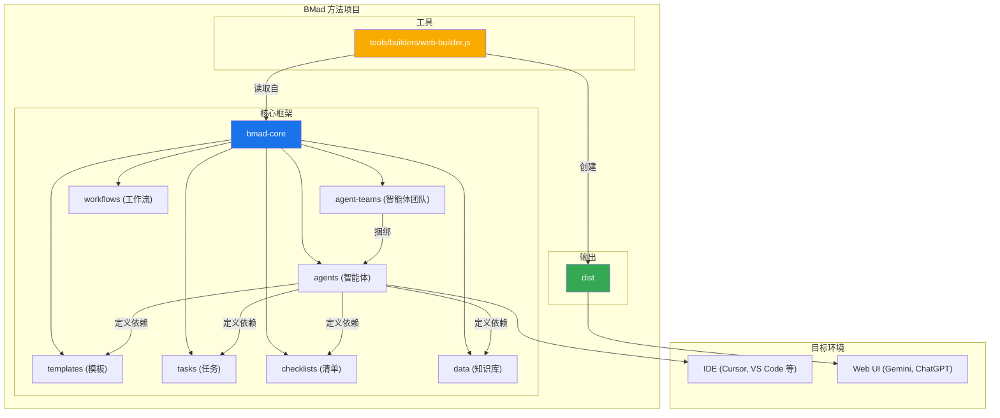
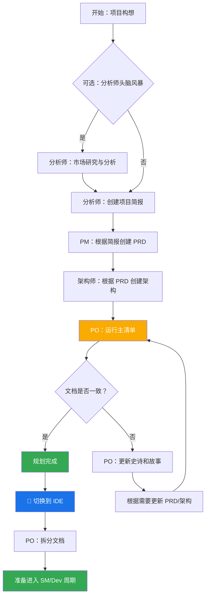
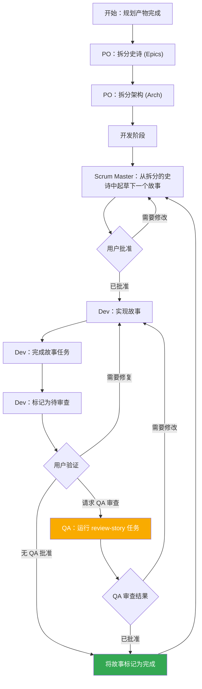

# BMad 方法：核心架构

## 1. 概述

BMad 方法旨在提供智能体模式、任务和模板，以便实现可重复的、有益的工作流，无论是用于敏捷的智能体开发，还是扩展到截然不同的领域。该项目的核心目的是提供一套结构化且灵活的提示、模板和工作流，用户可以利用它们来指导 AI 智能体（如 Gemini、Claude 或 ChatGPT）以可预测、高质量的方式执行复杂任务、引导性讨论或其他有意义的领域特定流程。

该系统的核心模块促进了一个完整的开发生命周期，专门为应对当前现代 AI 智能体工具的挑战而设计：

1.  **构思与规划 (Ideation & Planning)**：进行头脑风暴、市场研究，并创建项目简报。
2.  **架构与设计 (Architecture & Design)**：定义系统架构和 UI/UX 规范。
3.  **开发执行 (Development Execution)**：一个循环工作流，其中 Scrum Master (SM) 智能体起草具有极其具体上下文的故事（stories），而开发人员 (Dev) 智能体一次实现一个。这个过程适用于新项目 (Greenfield) 和现有项目 (Brownfield)。

## 2. 系统架构图

整个 BMad-Method 生态系统都围绕着已安装的 `bmad-core` 目录设计，该目录是操作的大脑。`tools` 目录提供了在不同环境中处理和打包这个大脑的方法。

## 3. 核心组件

`bmad-core` 目录包含了所有赋予智能体能力的定义和资源。

### 3.1. 智能体 (Agents) (`bmad-core/agents/`)

-   **目的**：这些是系统的基础构建块。每个 markdown 文件（例如，`bmad-master.md`, `pm.md`, `dev.md`）定义了单个 AI 智能体的角色、能力和依赖关系。
-   **结构**：一个智能体文件包含一个 YAML 头部，用于指定其角色、人格、依赖项和启动指令。这些依赖项是该智能体被允许使用的任务、模板、清单和数据文件的列表。
-   **启动指令**：智能体可以包含启动序列，从 `docs/` 文件夹加载项目特定的文档，如编码标准、API 规范或项目结构文档。这在激活时提供了即时的项目上下文。
-   **文档集成**：智能体可以在任务、工作流或启动序列中引用并加载项目 `docs/` 文件夹中的文档。用户也可以直接将文档拖入聊天界面以提供额外的上下文。
-   **示例**：`bmad-master` 智能体列出了它的依赖项，这告诉构建工具在 web 包中应包含哪些文件，并告知智能体自身的能力。

### 3.2. 智能体团队 (Agent Teams) (`bmad-core/agent-teams/`)

-   **目的**：团队文件（例如，`team-all.yaml`）定义了为特定目的捆绑在一起的智能体和工作流的集合，如“全栈开发”或“仅后端”。这为 Web UI 环境创建了一个更大、预打包的上下文。
-   **结构**：一个团队文件列出了要包含的智能体。它可以使用通配符，如 `"*"` 来包含所有智能体。这允许创建像 `team-all` 这样的综合包。

### 3.3. 工作流 (Workflows) (`bmad-core/workflows/`)

-   **目的**：工作流是 YAML 文件（例如，`greenfield-fullstack.yaml`），为特定项目类型定义了一系列预设的步骤和智能体交互。它们作为用户和 `bmad-orchestrator` 智能体的战略指南。
-   **结构**：一个工作流为复杂和简单的项目定义了序列，列出了每个步骤涉及的智能体、他们创建的产物（artifacts），以及从一个步骤进入下一个步骤的条件。它通常包含一个 Mermaid 图表以供可视化。

### 3.4. 可重用资源 (`templates`, `tasks`, `checklists`, `data`)

-   **目的**：这些文件夹存放了由智能体根据其依赖关系动态加载的模块化组件。
    -   `templates/`：包含常用文档的 markdown 模板，如 PRD、架构规范和用户故事。
    -   `tasks/`：定义了执行特定、可重复操作的指令，如“shard-doc”（文档分片）或“create-next-story”（创建下一个故事）。
    -   `checklists/`：为产品负责人 (`po`) 或架构师等智能体提供质量保证清单。
    -   `data/`：包含核心知识库 (`bmad-kb.md`)、技术偏好 (`technical-preferences.md`) 和其他关键数据文件。

#### 3.4.1. 模板处理系统

BMad 的一个关键架构原则是模板是自包含和交互式的——它们既嵌入了期望的文档输出，也嵌入了与用户协作所需的 LLM 指令。这意味着在许多情况下，创建文档不需要单独的任务，因为模板本身就包含了所有的处理逻辑。

BMad 框架采用一个复杂的模板处理系统，由三个关键组件协同工作：

-   **`template-format.md`** (`bmad-core/utils/`)：定义了所有 BMad 模板中使用的基础标记语言。该规范建立了变量替换 (`{{placeholders}}`)、仅供 AI 处理的指令 (`[[LLM: instructions]]`) 和条件逻辑块的语法规则。模板遵循此格式以确保在整个系统中处理的一致性。

-   **`create-doc.md`** (`bmad-core/tasks/`)：作为协调整个文档生成工作流的编排引擎。此任务协调模板选择，管理用户交互模式（增量式与快速生成），执行模板格式处理规则，并处理验证。它充当用户和模板系统之间的主要接口。

-   **`advanced-elicitation.md`** (`bmad-core/tasks/`)：提供了一个交互式的细化层，可以通过 `[[LLM: instructions]]` 块嵌入到模板中。该组件提供 10 个结构化的头脑风暴操作、分节审查功能和迭代改进工作流，以提高内容质量。

该系统保持了清晰的关注点分离：模板标记由 AI 智能体在内部处理，从不向用户展示，同时通过模板内嵌的智能提供复杂的 AI 处理能力。

#### 3.4.2. 技术偏好系统

BMad 通过 `bmad-core/data/` 中的 `technical-preferences.md` 文件包含了一个个性化层。该文件作为一个持久的技术配置文件，影响所有项目中智能体的行为。

**目的与好处：**

-   **一致性**：确保所有智能体都引用相同的技术偏好。
-   **效率**：无需重复指定偏好的技术。
-   **个性化**：智能体提供符合用户偏好的建议。
-   **学习**：捕获经验教训和随时间演变的偏好。

**内容结构：**
该文件通常包括偏好的技术栈、设计模式、外部服务、编码标准和应避免的反模式。智能体在规划和开发过程中会自动引用此文件，以提供与上下文相符的建议。

**集成点：**

-   模板可以在文档生成期间引用技术偏好。
-   当项目需求适用时，智能体会建议偏好的技术。
-   当偏好不适合项目需求时，智能体会解释替代方案。
-   Web 包可以包含偏好内容，以实现跨平台的一致行为。

**随时间演变：**
鼓励用户不断更新此文件，记录项目中的发现，添加正面偏好和应避免的技术，从而创建一个个性化的知识库，随时间推移改善智能体的建议。

## 4. 构建与交付过程

该框架专为两个主要环境设计：本地 IDE 和基于 Web 的 AI 聊天界面。`web-builder.js` 脚本是支持后者的关键。

### 4.1. Web 构建器 (Web Builder) (`tools/builders/web-builder.js`)

-   **目的**：这个 Node.js 脚本负责创建 `dist` 目录中的 `.txt` 包。
-   **过程**：
    1.  **解析依赖**：对于给定的智能体或团队，脚本会读取其定义文件。
    2.  它递归地查找该智能体/团队所需的所有依赖资源（任务、模板等）。
    3.  **捆绑内容**：它读取所有这些文件的内容，并将它们连接成一个单一的大型文本文件，并用清晰的分隔符标明每个部分的原始文件路径。
    4.  **输出包**：最终的 `.txt` 文件保存在 `dist` 目录中，准备好上传到 Web UI。

### 4.2. 特定环境的用法

-   **对于 IDE**：用户通过 `bmad-core/agents/` 中的 markdown 文件直接与智能体交互。IDE 集成（适用于 Cursor、Claude Code 等）知道如何调用这些智能体。
-   **对于 Web UI**：用户上传一个来自 `dist` 的预构建包。这个单一文件为 AI 提供了整个团队及其所需所有工具和知识的上下文。

## 5. BMad 工作流

### 5.1. 规划工作流

在开发开始之前，BMad 遵循一个结构化的规划工作流，为项目的成功执行奠定基础：

**关键规划阶段：**

1.  **可选分析**：分析师进行市场研究和竞争分析。
2.  **项目简报**：由分析师或用户创建的基础文档。
3.  **PRD 创建**：PM 将简报转化为全面的产品需求文档。
4.  **架构设计**：架构师根据 PRD 创建技术基础。
5.  **验证与对齐**：PO 确保所有文档都一致且完整。
6.  **细化**：根据需要更新史诗、故事和文档。
7.  **环境转换**：从 Web UI 切换到 IDE 进行开发工作流的关键步骤。
8.  **文档准备**：PO 将大型文档进行拆分，以供开发使用。

**工作流编排**：`bmad-orchestrator` 智能体使用这些工作流定义来引导用户完成整个过程，确保在规划（Web UI）和开发（IDE）阶段之间正确转换。

### 5.2. 核心开发周期

一旦初始规划和架构阶段完成，项目就进入一个循环的开发工作流，详见 `bmad-kb.md`。这确保了一个稳定、有序且质量可控的实施过程。

这个周期不断继续，由 Scrum Master、开发人员以及可选的 QA 智能体协同工作。QA 智能体通过 `review-story` 任务提供高级开发人员的审查能力，提供代码重构、质量改进和知识转移。这在保持开发速度的同时确保了高代码质量。
